# AI-Generated Da Vinci Notebook
A collection of AI-generated sketches in the style of Leonardo da Vinci's journals. Generated with MidJourney, edited by me in Gimp.
Close to 1,000 images were generated for this project, so each image was the best result of 20-30 variations on an idea. Most were unusable but the ones that came out well were edited to remove artifacts, formatted or combined into uniform pages, and arranged here.

 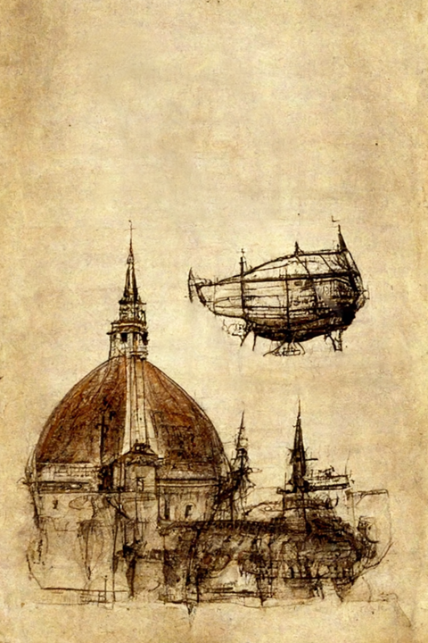 
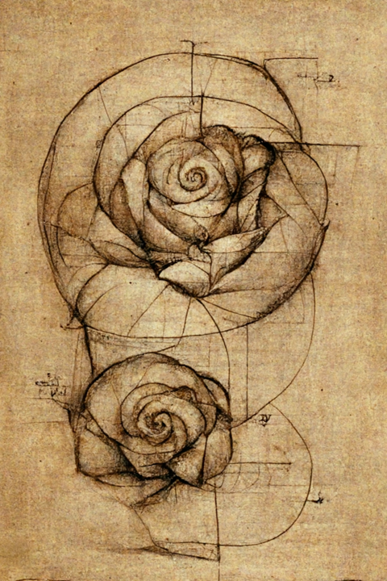
 
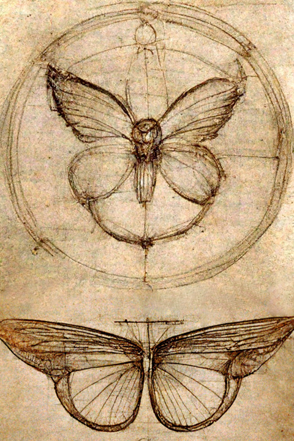
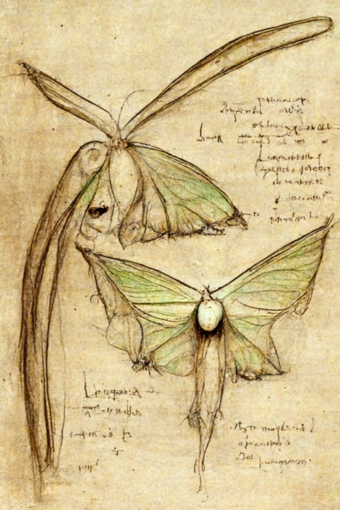
 
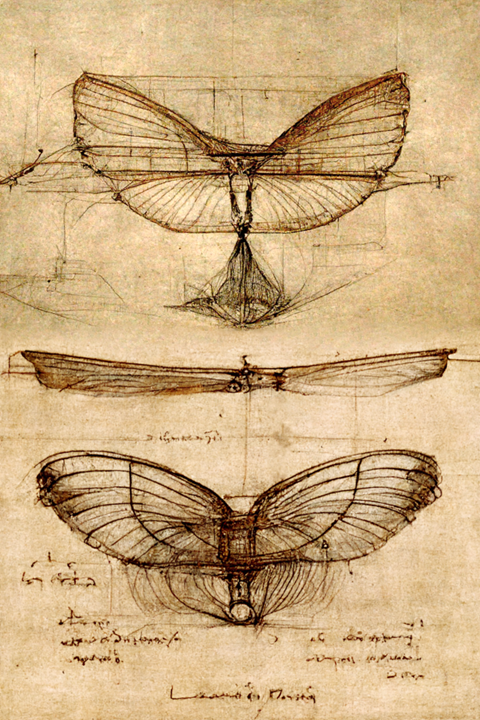
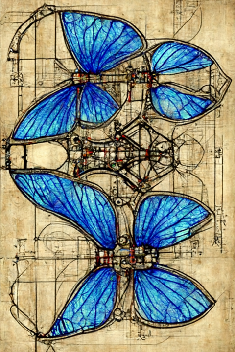
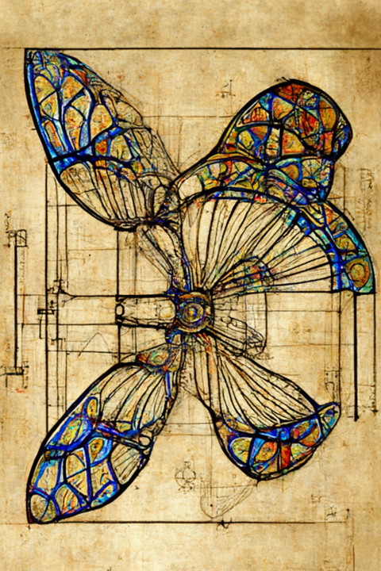

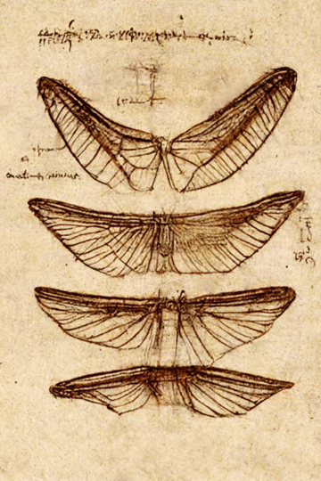

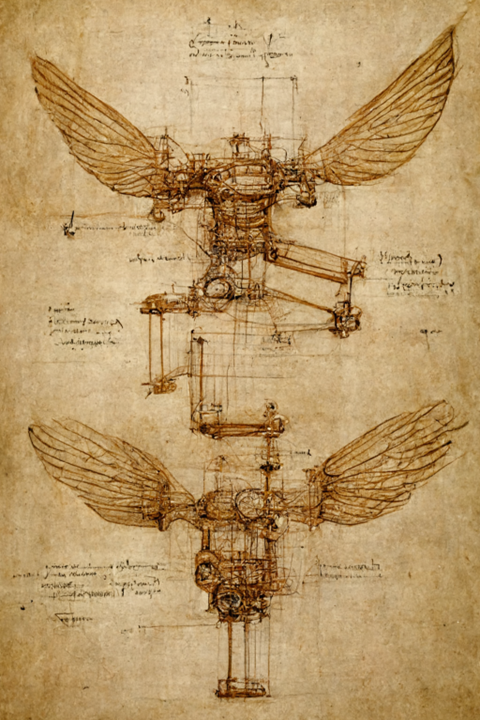
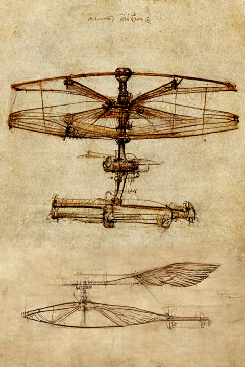
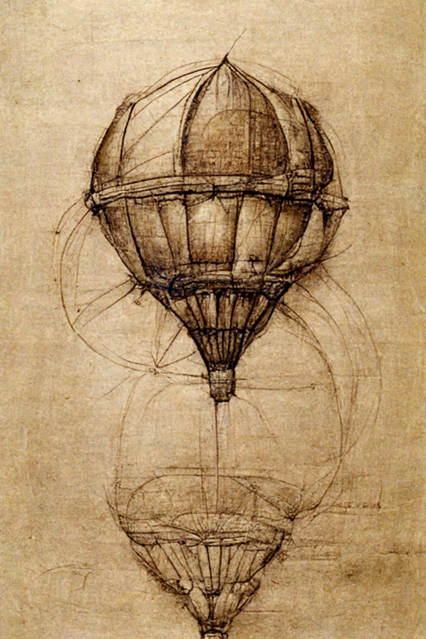

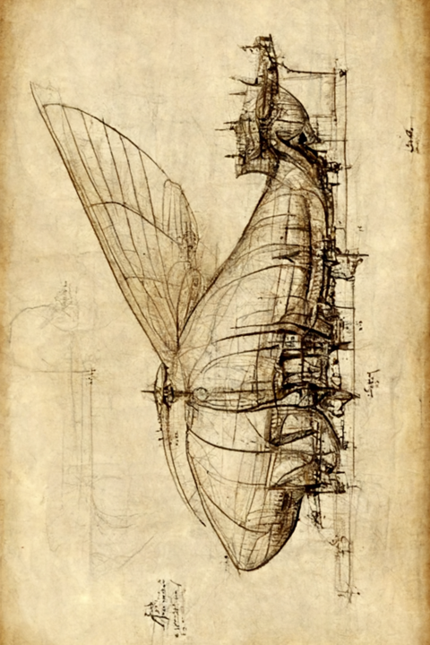
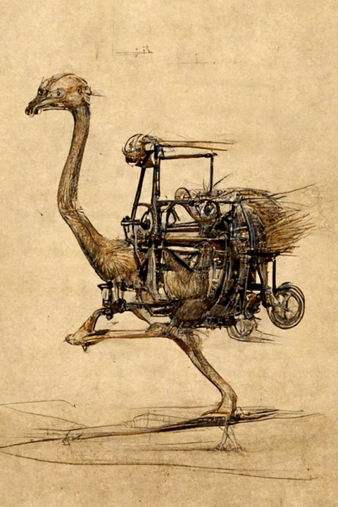

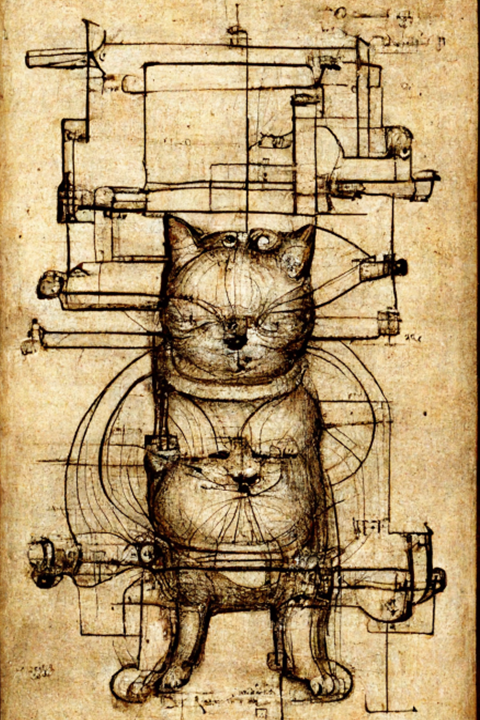
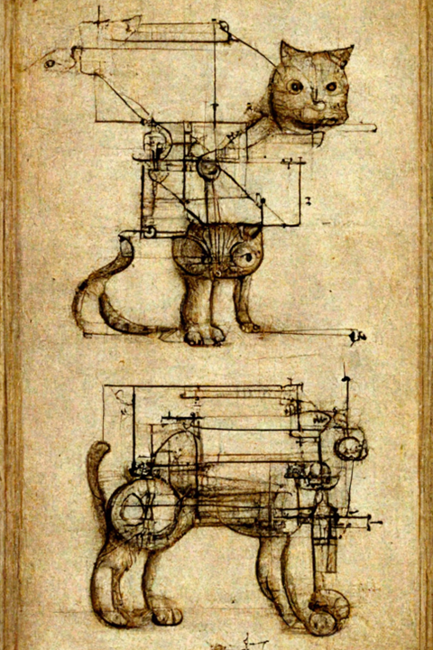
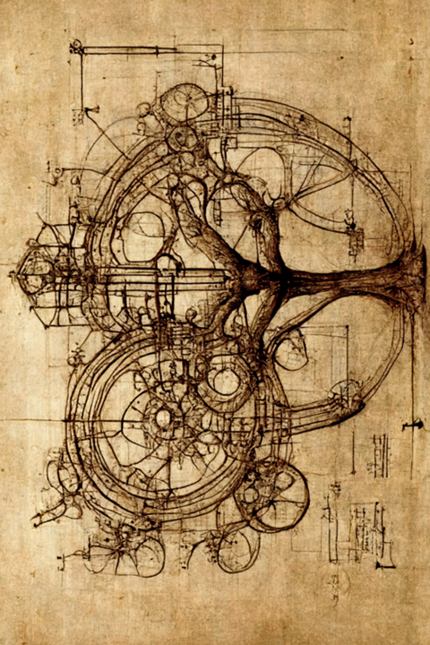

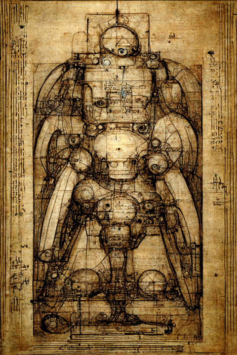

